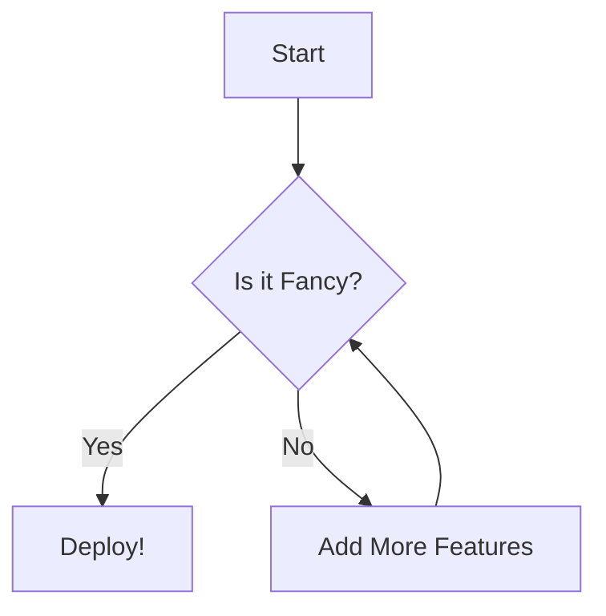

## The Ultimate Guide to Hosting a Fancy Static Wiki on GitHub Pages

### Our Chosen Stack

*   **Content:** Plaintext Markdown (`.md`). The K.I.S.S. principle in action.
*   **Static Site Generator (SSG):** **MkDocs**. A fast, simple, Python-based SSG perfect for project documentation and wikis.
*   **Theme:** **Material for MkDocs**. A stunning, feature-rich, and highly-customizable theme that makes MkDocs "fancy."
*   **Version Control:** **Git**. The de-facto standard.
*   **Hosting & CI/CD:** **GitHub** (Repositories, Actions, and Pages). The complete, integrated platform.

---

### Phase 1: Local Environment Setup (The Arch Way)

We will set up a clean, isolated local environment. An Arch user understands the importance of not polluting the global system.

#### Step 1: Install Core Dependencies
Open your terminal. We need Git, Python, and Python's package installer, `pip`.

```bash
# Refresh package databases
sudo pacman -Syu

# Install git, python, and python-pip
sudo pacman -S git python python-pip
```

#### Step 2: Create the Project Structure
Choose a location for your wiki project and create the directory.

```bash
# Create and enter the project directory
mkdir my-awesome-wiki
cd my-awesome-wiki
```

#### Step 3: Initialize Git Repository
Initialize the directory as a Git repository from the very beginning. This ensures every change is tracked.

```bash
git init
```

#### Step 4: Create and Activate a Python Virtual Environment
**This is a critical best practice.** We will isolate our project's Python dependencies from the system-wide packages.

```bash
# Create the virtual environment directory (e.g., named '.venv')
python -m venv .venv

# Activate the virtual environment
# Your shell prompt will change to indicate activation.
source .venv/bin/activate
```
*Pro-tip: Add `.venv/` to your global `.gitignore` file so you never commit virtual environments.*

#### Step 5: Install MkDocs and the Material Theme
With the virtual environment active, use `pip` to install our core tools.

```bash
pip install mkdocs mkdocs-material
```

#### Step 6: Create `requirements.txt` for Reproducibility
Immediately freeze your dependencies into a `requirements.txt` file. This is crucial for our automated GitHub Actions workflow later.

```bash
pip freeze > requirements.txt
```
Your `requirements.txt` will now contain the exact versions of `mkdocs`, `mkdocs-material`, and their dependencies, ensuring consistent builds everywhere.

#### Step 7: Bootstrap the MkDocs Project
Use the `mkdocs` command to create the initial file structure.

```bash
# The '.' indicates to create the files in the current directory
mkdocs new .
```
This creates two things:
*   `mkdocs.yml`: The main configuration file. The heart of your wiki.
*   `docs/`: A directory where all your Markdown content will live. It will have an `index.md` file by default.

#### Step 8: Test Your Local Setup
Before we configure anything, let's run the local development server.

```bash
mkdocs serve
```
Open your browser to `http://127.0.0.1:8000`. You will see a basic, un-themed welcome page. The `serve` command also features live-reloading, which is fantastic for writing content.

Press `Ctrl+C` to stop the server for now.

---

### Phase 2: Configuration & Content (Making it FANCY)

This is where we dial in the settings and add features.

#### Step 1: Supercharge `mkdocs.yml`
Open `mkdocs.yml` and replace its contents with this comprehensive starting point. **Read the comments to understand each line.**

```yaml
#
# --- Project Information ---
#
site_name: "My Awesome Wiki"
site_url: "https://<YOUR_USERNAME>.github.io/<YOUR_REPONAME>/" # IMPORTANT: Set this for SEO and sitemap.
site_author: "Your Name"
site_description: "A comprehensive guide to everything awesome."

#
# --- Repository ---
#
repo_name: "<YOUR_USERNAME>/<YOUR_REPONAME>"
repo_url: "https://github.com/<YOUR_USERNAME>/<YOUR_REPONAME>"
edit_uri: "edit/main/docs/" # Allows users to suggest edits directly on GitHub

#
# --- Theme Configuration (The "Fancy" Part) ---
#
theme:
  name: "material"
  logo: assets/logo.svg # Optional: create an 'assets' dir inside 'docs/'
  favicon: assets/favicon.png # Optional
  palette:
    # Palette toggle for light vs dark mode
    - media: "(prefers-color-scheme: light)"
      scheme: default
      toggle:
        icon: material/brightness-7
        name: Switch to dark mode
    - media: "(prefers-color-scheme: dark)"
      scheme: slate
      toggle:
        icon: material/brightness-4
        name: Switch to light mode
  features:
    - navigation.tabs # Use top-level sections as navigation tabs
    - navigation.sections # Expand sections in the side navigation
    - navigation.instant # Load pages instantly without full page reloads
    - navigation.tracking # URL automatically updates when scrolling
    - navigation.top # "Back to top" button
    - search.suggest # Autocomplete search results
    - search.highlight # Highlight search terms on result pages
    - content.code.annotate # Add annotations to code blocks
    - content.code.copy # Add a copy button to code blocks
    - header.autohide # Header hides on scroll

#
# --- Navigation Menu ---
# Define the order and structure of your pages here.
#
nav:
  - 'Home': 'index.md'
  - 'User Guides':
    - 'Getting Started': 'guides/getting-started.md'
    - 'Advanced Usage': 'guides/advanced-usage.md'
  - 'About': 'about.md'


#
# --- Markdown Extensions (Power Features) ---
#
markdown_extensions:
  - pymdownx.highlight: # Better syntax highlighting
      anchor_linenums: true
      line_spans: __span
      pygments_style: gruvbox-dark # Choose your favorite pygments style
  - pymdownx.inlinehilite
  - pymdownx.snippets # Include content from other files
  - pymdownx.superfences # Awesome for nested code/content blocks
  - admonition # Call-out blocks (e.g., !!! note "Title")
  - pymdownx.details # Collapsible blocks
  - attr_list # Add HTML attributes to Markdown elements
  - md_in_html
  - tables
```
**ACTION:** Replace `<YOUR_USERNAME>` and `<YOUR_REPONAME>` everywhere in this file.

#### Step 2: Create Initial Content
Based on our `nav` structure in `mkdocs.yml`, create the necessary files and directories.

```bash
# Create the directory for guides
mkdir -p docs/guides

# Create the placeholder markdown files
touch docs/guides/getting-started.md docs/guides/advanced-usage.md docs/about.md
```
Now, add some content to these files. For example, in `docs/guides/getting-started.md`:

```markdown
# Getting Started

Welcome to the getting started guide!

## Installation

This is a simple process.

```bash
# This is a bash command
echo "Hello, Wiki!"
```

## Next Steps

Check out the [Advanced Usage](advanced-usage.md) guide next.

!!! note "An important note"
    This is an "admonition" block, made possible by the markdown extension. They are great for highlighting information.
```

#### Step 3: Local Re-Test
Run `mkdocs serve` again. Visit `http://127.0.0.1:8000`. You should now see a beautiful, dark/light-mode aware, tabbed wiki with your new content structure. Test the search, copy code buttons, and other features. This is your rapid development loop.

---

### Phase 3: GitHub Integration and Automation

Now we will push our work to GitHub and set up the "magic" that deploys it automatically.

#### Step 1: Create the GitHub Repository
Go to [GitHub](https://github.com/new) and create a new **public** repository. **Do not** initialize it with a README, .gitignore, or license, as we have already created these locally. Name it `my-awesome-wiki` (or whatever you chose).

#### Step 2: Push Your Local Repository to GitHub
Follow the instructions provided by GitHub under "...or push an existing repository from the command line":

```bash
# Add a .gitignore file *before* your first commit
echo ".venv/" >> .gitignore
echo "site/" >> .gitignore # The build output directory

git add .
git commit -m "feat: Initial wiki structure and configuration"

# Link your local repo to the remote one on GitHub
git remote add origin https://github.com/<YOUR_USERNAME>/<YOUR_REPONAME>.git
git branch -M main
git push -u origin main
```
*Your `main` branch, containing all your Markdown source and configuration, is now on GitHub.*

#### Step 3: The Automated Workflow - GitHub Actions
This is the core of our automated deployment. We will create a workflow that:
1.  Triggers on every push to the `main` branch.
2.  Checks out the code.
3.  Sets up Python and installs dependencies from `requirements.txt`.
4.  Builds the static HTML site using `mkdocs build`.
5.  Deploys the generated HTML to a special `gh-pages` branch.

Create the workflow directory and file:

```bash
mkdir -p .github/workflows
touch .github/workflows/deploy.yml
```
Now, paste the following YAML into `deploy.yml`:

```yaml
# .github/workflows/deploy.yml
name: Deploy Wiki to GitHub Pages

on:
  # Trigger the workflow on push events to the 'main' branch
  push:
    branches:
      - main
  # Allows you to run this workflow manually from the Actions tab
  workflow_dispatch:

# Grant GITHUB_TOKEN the permissions required to deploy to GitHub Pages
permissions:
  contents: read
  pages: write
  id-token: write

jobs:
  deploy:
    name: Deploy to GitHub Pages
    runs-on: ubuntu-latest
    environment:
      name: github-pages
      url: ${{ steps.deployment.outputs.page_url }}
      
    steps:
      # 1. Checkout the repository so the job can access it
      - name: Checkout repository
        uses: actions/checkout@v4

      # 2. Setup Python, using cache for faster builds
      - name: Set up Python
        uses: actions/setup-python@v5
        with:
          python-version: 3.x
          cache: 'pip'

      # 3. Install dependencies from our requirements file
      - name: Install dependencies
        run: pip install -r requirements.txt

      # 4. Build the static site
      - name: Build with MkDocs
        run: mkdocs build # Output is placed in the 'site' directory

      # 5. Setup GitHub Pages
      - name: Setup Pages
        uses: actions/configure-pages@v4

      # 6. Upload the built site as an artifact
      - name: Upload artifact
        uses: actions/upload-pages-artifact@v3
        with:
          path: ./site

      # 7. Deploy to GitHub Pages
      - name: Deploy to GitHub Pages
        id: deployment
        uses: actions/deploy-pages@v4
```

#### Step 4: Commit and Push the Workflow
This is the commit that will kick off the first automated deployment.

```bash
git add .github/workflows/deploy.yml
git commit -m "ci: Add GitHub Actions workflow for auto-deployment"
git push
```

#### Step 5: Enable GitHub Pages
1.  In your GitHub repository, go to **Settings > Pages**.
2.  Under "Build and deployment", change the **Source** to **GitHub Actions**.
3.  GitHub will now be configured to serve the site built by your new Action.

Wait for a minute or two. You can monitor the progress in the "Actions" tab of your repository. Once the workflow completes successfully, your site will be live at `https://<YOUR_USERNAME>.github.io/<YOUR_REPONAME>/`.

---

### Phase 4: Advanced Optimizations & Enhancements

Your wiki is live, but an expert always optimizes.

#### 1. SEO & Performance: Minify Assets
Smaller files mean faster load times. Let's add a minification plugin.

**a. Install the plugin locally:**
```bash
# Make sure your venv is active: source .venv/bin/activate
pip install mkdocs-minify-plugin
```

**b. Update `requirements.txt`:**
```bash
pip freeze > requirements.txt
```

**c. Configure `mkdocs.yml`:**
Add the `plugins` section to your `mkdocs.yml`. The `search` plugin is built-in and enabled by default, but we'll declare it explicitly for clarity.

```yaml
# In mkdocs.yml, at the same level as 'theme' and 'nav'

plugins:
  - search
  - minify:
      minify_html: true
      minify_js: true
      minify_css: true
      htmlmin_opts:
        remove_comments: true
```
**d. Commit and Push:**
```bash
git add mkdocs.yml requirements.txt
git commit -m "perf: Add minify plugin to optimize assets"
git push
```
The next deployment will automatically build smaller, minified files.

#### 2. Domain: Use a Custom Domain
Serving from `your-wiki.com` is more professional.

**a. DNS Setup:** In your domain registrar's DNS settings, add records pointing to GitHub's servers. **Choose ONE of the following:**
*   **For an apex domain (e.g., `your-wiki.com`):** Add `A` records:
    *   `185.199.108.153`
    *   `185.199.109.153`
    *   `185.199.110.153`
    *   `185.199.111.153`
*   **For a subdomain (e.g., `wiki.your-domain.com`):** Add a `CNAME` record pointing to `<YOUR_USERNAME>.github.io`.

**b. GitHub Setup:**
1.  Go to **Settings > Pages** in your repo.
2.  In the "Custom domain" field, enter your domain (e.g., `wiki.your-domain.com`) and click **Save**.
3.  Wait for the DNS check to pass, then tick the **Enforce HTTPS** box.
4.  **CRITICAL:** Update the `site_url` in your `mkdocs.yml` to your new custom domain (e.g., `https://wiki.your-domain.com/`). Commit and push this change.

#### 3. Content: Diagrams with Mermaid.js
Add beautiful diagrams directly in your markdown.

**a. Configure `mkdocs.yml`:** Add the `pymdownx.superfences` custom fence for mermaid.

```yaml
# In mkdocs.yml, under markdown_extensions -> pymdownx.superfences
markdown_extensions:
  - pymdownx.superfences:
      custom_fences:
        - name: mermaid
          class: mermaid
          format: !!python/name:pymdownx.superfences.fence_code_format
```

**b. Add JavaScript to `mkdocs.yml`:** Tell Material to load the Mermaid.js library.
```yaml
# In mkdocs.yml, at the root level
extra_javascript:
  - https://unpkg.com/mermaid@9.4.0/dist/mermaid.min.js
```
**c. Use it in your Markdown:**
````markdown

````
**d. Commit and push.** Your next deploy will render this as a diagram.

### Workflow Complete

You now have a fully automated, version-controlled, highly optimized, and feature-rich static wiki. Your workflow is simple:
1.  Edit or add `.md` files in the `docs` directory.
2.  Run `mkdocs serve` to preview locally.
3.  `git commit` and `git push` your changes.
4.  GitHub Actions takes care of the rest, deploying your updated site in minutes.
